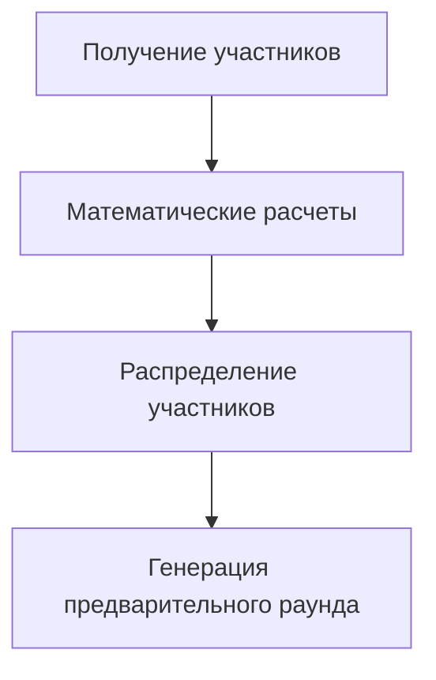
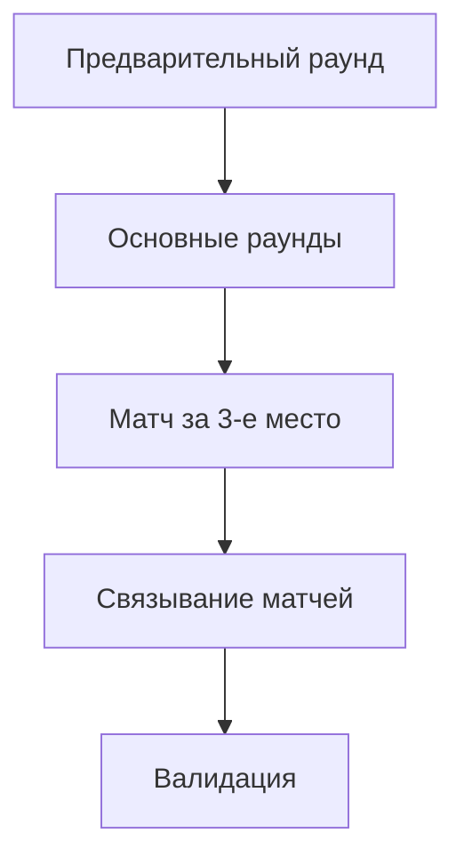
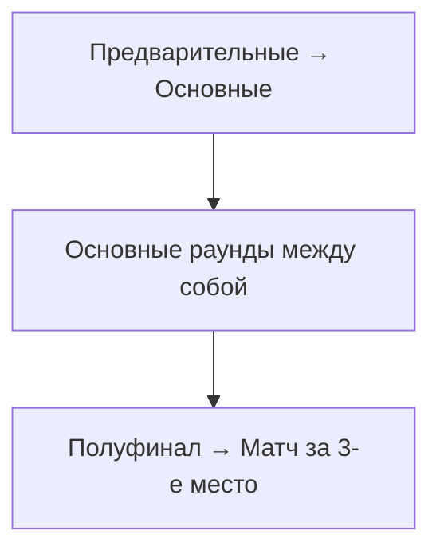

# 🏆 Single Elimination V2.0 - Техническая документация

**Версия:** 2.0  
**Дата:** 2024-01-22  
**Статус:** Готов к развертыванию  

## 📋 Обзор

Single Elimination V2.0 - это полностью переписанная математически корректная система генерации турнирных сеток на выбывание. Система исправляет все математические ошибки предыдущей версии и добавляет новые возможности.

## 🎯 Ключевые улучшения

### ✅ Исправленные проблемы
1. **Математически корректная логика предварительного раунда**
2. **Правильное распределение участников между предварительным раундом и автопроходом**
3. **Корректные названия раундов с конца сетки**
4. **Автоматическая валидация турнирных сеток**

### 🆕 Новые возможности
1. **Интерактивное модальное окно** для выбора матча за 3-е место
2. **Автоматические названия матчей** (Финал, Полуфинал, 1/4, 1/8)
3. **PostgreSQL триггеры** для автоматического обновления названий
4. **Детальная валидация** сгенерированных сеток

## 🧮 Математическая основа

### Формула расчета предварительного раунда

```javascript
// Для N участников:
const targetParticipants = 2^⌊log₂(N)⌋        // Ближайшая степень двойки снизу
const toEliminate = N - targetParticipants     // Участников для исключения
const preliminaryMatches = toEliminate         // Количество предварительных матчей
const preliminaryPlayers = 2 * toEliminate     // Участников в предварительном раунде
const byePlayers = N - preliminaryPlayers     // Участников с автопроходом
```

### Примеры расчетов

| Участников | Целевое число | Предв. матчей | В предв. раунде | Автопроход |
|------------|---------------|---------------|-----------------|------------|
| 5          | 4 (2²)        | 1             | 2               | 3          |
| 6          | 4 (2²)        | 2             | 4               | 2          |
| 13         | 8 (2³)        | 5             | 10              | 3          |
| 21         | 16 (2⁴)       | 5             | 10              | 11         |

## 🛠️ Техническая архитектура

### Backend компоненты

#### 1. Генератор сеток (`singleEliminationV2.js`)

**Основные функции:**
- `calculateTournamentMath()` - математические расчеты
- `distributeParticipants()` - распределение участников
- `generatePreliminaryMatches()` - создание предварительного раунда
- `generateMainRounds()` - создание основных раундов
- `generateThirdPlaceMatch()` - создание матча за 3-е место
- `linkMatches()` - связывание матчей в дерево
- `validateGeneratedBracket()` - валидация результата

#### 2. Схема базы данных (`single_elimination_schema_update.sql`)

**Новые поля в таблице `matches`:**
```sql
round_name VARCHAR(50)              -- Название раунда
match_title VARCHAR(100)            -- Полное название матча
is_preliminary_round BOOLEAN        -- Предварительный раунд
bye_match BOOLEAN                   -- Матч с автопроходом
loser_next_match_id INTEGER         -- Следующий матч для проигравшего
position_in_round INTEGER           -- Позиция в раунде
```

**Функции PostgreSQL:**
- `calculate_round_name()` - автоматический расчет названий раундов
- `validate_single_elimination_bracket()` - валидация сетки
- `update_match_round_names()` - триггер обновления названий

### Frontend компоненты

#### 1. Модальное окно (`ThirdPlaceMatchModal.js`)

**Возможности:**
- Интерактивный выбор необходимости матча за 3-е место
- Отображение информации о турнире
- Сравнение преимуществ/недостатков
- Красивая анимация и дизайн в стиле 1337 Community

#### 2. Обновленный `TournamentDetails.js`

**Изменения:**
- Интеграция модального окна
- Обновленная функция `handleGenerateBracket()`
- Передача параметра `thirdPlaceMatch` в API
- Обработка состояний модального окна

## 🔄 Алгоритм работы

### 1. Инициализация


### 2. Генерация сетки


### 3. Связывание матчей


## 📊 API изменения

### Обновленный endpoint

```javascript
POST /api/tournaments/:id/generate-bracket
Content-Type: application/json

{
    "thirdPlaceMatch": true|false
}
```

**Ответ:**
```javascript
{
    "success": true,
    "message": "Турнирная сетка успешно сгенерирована с матчем за 3-е место!",
    "tournament": { /* данные турнира */ }
}
```

## 🔍 Валидация сетки

### Автоматические проверки

1. **Количество матчей:** `N участников = N-1 матчей` (+ матч за 3-е место)
2. **Связи между матчами:** каждый матч корректно связан со следующим
3. **Предварительный раунд:** правильное количество матчей и участников
4. **Названия раундов:** корректное автоматическое присвоение

### Функция валидации

```sql
SELECT * FROM validate_single_elimination_bracket(tournament_id);
```

Возвращает:
- `is_valid` - корректность сетки
- `error_message` - описание ошибки
- `participants_count` - количество участников
- `matches_count` - количество матчей
- `preliminary_matches` - предварительных матчей

## 🎨 UI/UX улучшения

### Модальное окно выбора матча за 3-е место

**Функции:**
- Красивая анимация появления
- Информация о турнире
- Сравнение вариантов
- Три кнопки: "Да", "Нет", "Отмена"

**CSS стили:**
- Темная тема в стиле 1337 Community
- Градиенты и анимации
- Адаптивный дизайн
- Hover эффекты

## 🚀 Развертывание

### Автоматическое развертывание

```bash
chmod +x deploy_single_elimination_v2.sh
./deploy_single_elimination_v2.sh
```

### Ручное развертывание

1. **Обновление схемы БД:**
```bash
sudo -u postgres psql -d tournament_db -f database/single_elimination_schema_update.sql
```

2. **Копирование backend файлов:**
```bash
cp backend/bracketGenerators/singleEliminationV2.js /var/www/1337community.com/backend/bracketGenerators/
cp backend/bracketGenerator.js /var/www/1337community.com/backend/
```

3. **Копирование frontend файлов:**
```bash
cp frontend/src/components/tournament/modals/ThirdPlaceMatchModal.* /var/www/1337community.com/frontend/src/components/tournament/modals/
cp frontend/src/components/TournamentDetails.js /var/www/1337community.com/frontend/src/components/
```

4. **Перезапуск сервисов:**
```bash
systemctl restart 1337-backend
cd /var/www/1337community.com/frontend && npm run build
```

## 🧪 Тестирование

### Тестовые сценарии

1. **5 участников:**
   - Ожидается: 1 предварительный матч, 3 основных раунда
   - Проверить: корректное распределение участников

2. **13 участников:**
   - Ожидается: 5 предварительных матчей, 3 основных раунда
   - Проверить: автопроход для 3 участников

3. **Матч за 3-е место:**
   - Проверить: появление модального окна
   - Проверить: создание дополнительного матча
   - Проверить: связывание с полуфиналом

### Валидация

```sql
-- Проверка новых полей
SELECT column_name FROM information_schema.columns 
WHERE table_name = 'matches' AND column_name IN ('round_name', 'match_title');

-- Проверка функций
SELECT routine_name FROM information_schema.routines 
WHERE routine_name = 'calculate_round_name';

-- Тест валидации сетки
SELECT * FROM validate_single_elimination_bracket(1);
```

## 📋 Примеры использования

### Создание турнира для 6 участников

1. Пользователь нажимает "Сгенерировать сетку"
2. Появляется модальное окно выбора матча за 3-е место
3. Пользователь выбирает "Да, нужен"
4. Система создает:
   - 2 предварительных матча (4 участника)
   - 2 основных раунда (автопроход для 2 участников)
   - 1 матч за 3-е место

### Результирующая структура

```
Предварительный раунд:
- Матч 1: Участник A vs Участник B
- Матч 2: Участник C vs Участник D

Основной раунд (1/2 финала):
- Матч 3: Участник E vs Победитель матча 1
- Матч 4: Участник F vs Победитель матча 2

Финал:
- Матч 5: Победитель матча 3 vs Победитель матча 4

Матч за 3-е место:
- Матч 6: Проигравший матча 3 vs Проигравший матча 4
```

## 🔧 Диагностика и отладка

### Логирование

Все операции логируются с детальной информацией:

```javascript
console.log('🧮 МАТЕМАТИКА ТУРНИРА для 6 участников:');
console.log('   • Целевая степень двойки: 2^2 = 4');
console.log('   • Исключить участников: 2');
console.log('   • Предварительных матчей: 2');
```

### Проверка состояния

```sql
-- Просмотр турнирной сетки
SELECT id, round, round_name, match_title, team1_id, team2_id, is_preliminary_round
FROM matches 
WHERE tournament_id = ? 
ORDER BY round, position_in_round;

-- Статистика турнира
SELECT * FROM tournament_bracket_info WHERE tournament_id = ?;
```

## 🐛 Известные ограничения

1. **Минимум участников:** 2
2. **Поддерживаемые форматы:** только Single Elimination
3. **Матч за 3-е место:** доступен только при наличии полуфинала

## 📈 Планы развития

### Версия 2.1
- [ ] Поддержка пользовательских названий раундов
- [ ] Расширенная валидация
- [ ] Автоматический реванш в финале

### Версия 2.2
- [ ] Гибридные форматы турниров
- [ ] Групповые этапы + плей-офф
- [ ] Швейцарская система

## 📞 Поддержка

При возникновении проблем:

1. Проверьте логи backend службы: `journalctl -u 1337-backend`
2. Проверьте состояние БД: `SELECT * FROM validate_single_elimination_bracket(?)`
3. Проверьте frontend консоль в браузере

---

**Автор:** AI Assistant  
**Команда:** 1337 Community  
**Контакт:** root@80.87.200.23 